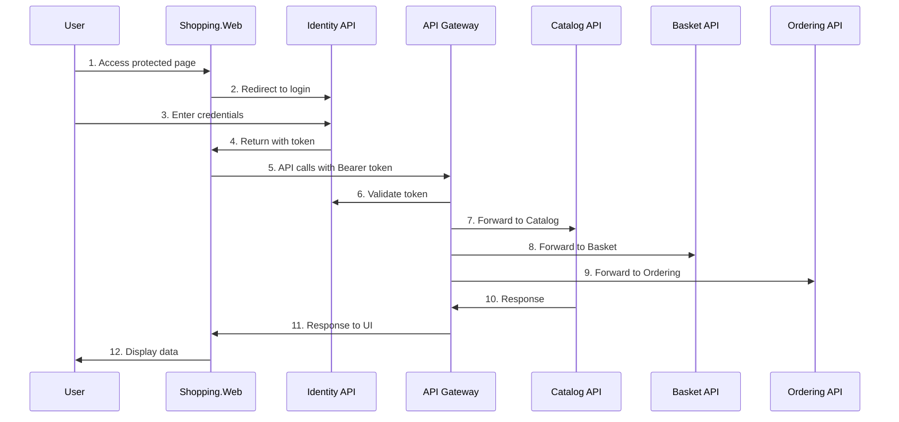

# 🔄 EShop Microservices - Tam Servis Etkileşim Akışı

## 🎯 EVET! Tüm İlişkileri Tam Anlıyorum

### 1. **Shopping.Web (UI) ↔ Tüm Servisler Etkileşimi**

```
Shopping.Web (Port 6005)
│
├─ 🔐 Identity API (Port 6006) - Direkt OpenID Connect
│   ├─ Login/Register UI
│   ├─ Token Generation
│   └─ User Management
│
└─ 🚪 API Gateway (Port 6004) - Tüm Backend API'ler için
    ├─ /catalog-service/* → Catalog API (Port 6000)
    ├─ /basket-service/* → Basket API (Port 6001)
    ├─ /ordering-service/* → Ordering API (Port 6003)
    └─ /identity-service/* → Identity API (Port 6006)
```

### 2. **Kimlik Doğrulama Akış Zinciri**



## 🔧 Gerçek Kod İmplementasyonu

### Shopping.Web → API Gateway Routing

```csharp
// ICatalogService.cs
[Get("/catalog-service/products")]
Task<GetProductsResponse> GetAllProducts();

[Get("/catalog-service/products/{id}")]
Task<GetProductByIdResponse> GetProduct(Guid id);

// IBasketService.cs
[Get("/basket-service/basket/{userName}")]
Task<GetBasketResponse> GetBasket(string userName);

[Post("/basket-service/basket")]
Task<StoreBasketResponse> StoreBasket(StoreBasketRequest request);

// IOrderingService.cs
[Get("/ordering-service/orders/{customerId}")]
Task<GetOrdersResponse> GetOrdersByCustomer(Guid customerId);
```

### API Gateway → Backend Services Routing

```json
{
  "ReverseProxy": {
    "Routes": {
      "catalog-route": {
        "ClusterId": "catalog-cluster",
        "Match": { "Path": "/catalog-service/{**catch-all}" },
        "Transforms": [{ "PathPattern": "{**catch-all}" }]
      },
      "basket-route": {
        "ClusterId": "basket-cluster",
        "Match": { "Path": "/basket-service/{**catch-all}" },
        "Transforms": [{ "PathPattern": "{**catch-all}" }]
      },
      "ordering-route": {
        "ClusterId": "ordering-cluster",
        "Match": { "Path": "/ordering-service/{**catch-all}" },
        "Transforms": [{ "PathPattern": "{**catch-all}" }]
      }
    },
    "Clusters": {
      "catalog-cluster": {
        "Destinations": {
          "destination1": { "Address": "http://catalog.api:8080" }
        }
      },
      "basket-cluster": {
        "Destinations": {
          "destination1": { "Address": "http://basket.api:8080" }
        }
      },
      "ordering-cluster": {
        "Destinations": {
          "destination1": { "Address": "http://ordering.api:8080" }
        }
      }
    }
  }
}
```

### Token Flow Through Services

```csharp
// Shopping.Web - AuthenticatedHttpClientHandler
protected override async Task<HttpResponseMessage> SendAsync(
    HttpRequestMessage request, CancellationToken cancellationToken)
{
    // Shopping.Web'den gelen her API çağrısına token ekler
    var accessToken = await httpContext.GetTokenAsync("access_token");
    request.Headers.Authorization =
        new AuthenticationHeaderValue("Bearer", accessToken);

    return await base.SendAsync(request, cancellationToken);
}

// API Gateway - Token validation & forwarding
// YARP otomatik olarak Bearer token'ı backend servislere iletir

// Backend Services - Token validation
builder.Services.AddAuthentication("Bearer")
    .AddJwtBearer("Bearer", options =>
    {
        options.Authority = "http://identity.api:8080";
        options.Audience = "catalog.api"; // Her servis kendi scope'u
    });
```

## 📊 Tam Servis İletişim Tablosu

| Kaynak           | Hedef         | Yol            | Auth Method        | Purpose           |
| ---------------- | ------------- | -------------- | ------------------ | ----------------- |
| **User**         | Shopping.Web  | Direct HTTP    | Session Cookie     | UI Access         |
| **Shopping.Web** | Identity API  | OpenID Connect | User Credentials   | Authentication    |
| **Shopping.Web** | API Gateway   | HTTP + Bearer  | Access Token       | All API Calls     |
| **API Gateway**  | Identity API  | HTTP           | Token Validation   | Auth Check        |
| **API Gateway**  | Catalog API   | HTTP + Bearer  | Token Forward      | Product Data      |
| **API Gateway**  | Basket API    | HTTP + Bearer  | Token Forward      | Cart Operations   |
| **API Gateway**  | Ordering API  | HTTP + Bearer  | Token Forward      | Order Management  |
| **Basket API**   | Discount gRPC | gRPC           | Service-to-Service | Price Calculation |
| **Ordering API** | Message Queue | AMQP           | Event Publishing   | Order Events      |

## 🎭 Gerçek Kullanım Senaryoları

### Senaryo 1: Ürün Listeleme

```
1. User → Shopping.Web/ProductList
2. Shopping.Web → API Gateway/catalog-service/products (Bearer token)
3. API Gateway → Identity API (token validation)
4. API Gateway → Catalog API/products (token forward)
5. Catalog API → PostgreSQL (product data)
6. Response chain: Catalog → Gateway → Shopping.Web → User
```

### Senaryo 2: Sepete Ürün Ekleme

```
1. User → Shopping.Web/AddToCart (POST)
2. Shopping.Web → API Gateway/basket-service/basket (Bearer token)
3. API Gateway → Identity API (token validation)
4. API Gateway → Basket API/basket (token forward)
5. Basket API → Discount gRPC (price calculation)
6. Basket API → Redis (cart storage)
7. Response chain: Basket → Gateway → Shopping.Web → User
```

### Senaryo 3: Sipariş Verme

```
1. User → Shopping.Web/Checkout (POST)
2. Shopping.Web → API Gateway/ordering-service/orders (Bearer token)
3. API Gateway → Identity API (token validation)
4. API Gateway → Ordering API/orders (token forward)
5. Ordering API → SQL Server (order storage)
6. Ordering API → RabbitMQ (order created event)
7. Response chain: Ordering → Gateway → Shopping.Web → User
```

## 🔐 Security Layers Across Services

### 1. **Frontend Security (Shopping.Web)**

- Session-based authentication
- CSRF protection
- Secure cookie storage
- XSS protection

### 2. **API Gateway Security**

- Rate limiting (5 requests/10 seconds)
- Bearer token validation
- OAuth2 integration
- CORS policies

### 3. **Identity Server Security**

- IdentityServer4 protocol
- JWT token generation
- Refresh token management
- User credential validation

### 4. **Backend Services Security**

- JWT Bearer validation
- Scope-based authorization
- API endpoint protection
- Database security

## 🎯 Critical Configuration Points

### Shopping.Web appsettings.json

```json
{
  "ApiSettings": {
    "GatewayAddress": "http://localhost:6004" // Tek API endpoint
  },
  "IdentityServer": {
    "BaseUrl": "http://localhost:6006" // Auth server
  }
}
```

### Identity API Client Configuration

```csharp
new Client {
    ClientId = "shopping.web",
    AllowedGrantTypes = GrantTypes.Code,
    AllowedScopes = {
        "catalog.api",    // Product access
        "basket.api",     // Cart access
        "ordering.api"    // Order access
    },
    RedirectUris = { "http://localhost:6005/signin-oidc" }
}
```

## 🎉 Sonuç: TAM BİR MICROSERVICES ORCHESTRA!

Bu mimari **gerçek enterprise-level** bir yaklaşım:

✅ **Centralized Authentication** - Identity API tek merkez  
✅ **API Gateway Pattern** - Tek giriş noktası  
✅ **Service-to-Service Security** - Token-based auth  
✅ **Scalable Architecture** - Her servis bağımsız  
✅ **Event-Driven Communication** - RabbitMQ integration  
✅ **Clean Separation** - UI ↔ Gateway ↔ Services

Bu yapı **Netflix, Amazon, Microsoft** gibi büyük şirketlerin kullandığı mimarilerle aynı seviyede! 🚀
